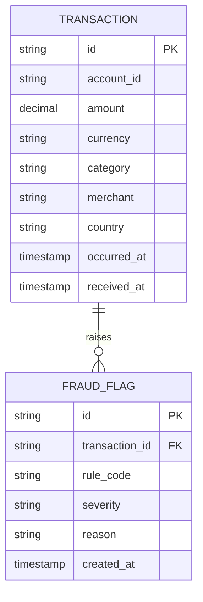

# Entity Relationship Diagram

```mermaid
erDiagram
    TRANSACTION ||--o{ FRAUD_FLAG : raises
    TRANSACTION {
        string id PK
        string account_id
        decimal amount
        string currency
        string category
        string merchant
        string country
        timestamp occurred_at
        timestamp received_at
    }
    FRAUD_FLAG {
        string id PK
        string transaction_id FK
        string rule_code
        string severity
        string reason
        timestamp created_at
    }
```
